# Cuprite

<p align="center">
  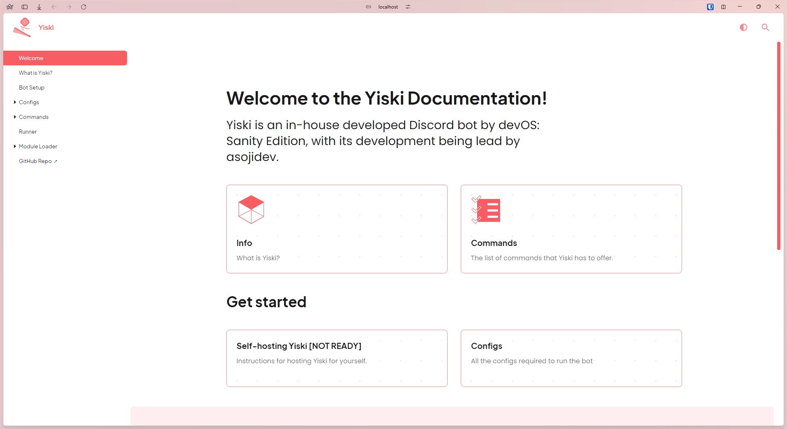</img>
  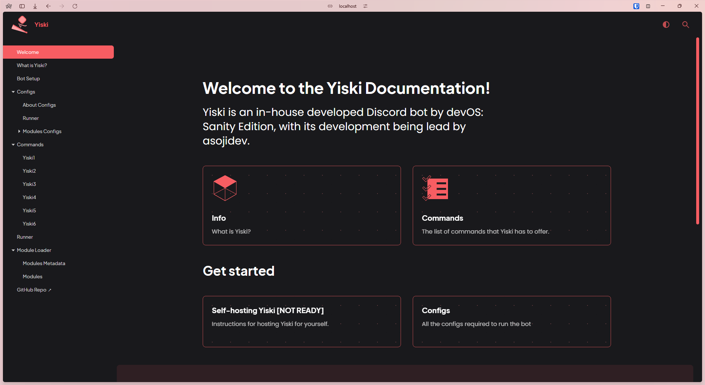</img>
</p>

Cuprite is a rounded corners theme designed for Writerside documentation. The point is to make it look simplistic and as clean as with some other visual hints and animation to adminitions and cards.

If you want to see how Cuprite looks in a live environment, you can view the [Yiski documentation](https://yiski.devos.one).

> [!NOTE]
> We do not support Algolia search as we don't have a key, so the theme is likely to look off with Search functions. Sorry about that. This may change in the future though.

## Usage

> [!IMPORTANT]
> This is meant to be used with Writerside 2024.1 EAP as of the time of writing, older versions of Writerside will not be supported!

Open your Writerside project and go to your `Writerside/cfg/buildprofiles.xml`, and allow Custom CSS by adding to your Build Profile's Variables, and adding a Link Color and Primary Color to your Variables too, like so

```xml
<?xml version="1.0" encoding="UTF-8"?>
<!DOCTYPE buildprofiles SYSTEM "https://resources.jetbrains.com/writerside/1.0/build-profiles.dtd">
<buildprofiles xsi:noNamespaceSchemaLocation="https://resources.jetbrains.com/writerside/1.0/build-profiles.xsd"
               xmlns:xsi="http://www.w3.org/2001/XMLSchema-instance">

    <variables></variables>
    <build-profile instance="docs">
        <variables>
            <primary-color>#F75D62</primary-color>
            <link-color>#F75D62</link-color>
            <custom-css>custom.css</custom-css>
        </variables>
        </footer>
    </build-profile>

</buildprofiles>
```

Now under `Writerside/cfg`, make a new folder called `static`, and then a file named `custom.css`. Writerside will now pull that Custom CSS file.

Now go to https://github.com/devOS-Sanity-Edition/Cuprite/blob/main/Cuprite.css and download the CSS file. Drop that CSS file into the same `static` directory.

On the top, add this if you want *all* of the CSS tweaks Cuprite makes

```css
@import "Cuprite.css";
```

After that, add the following to your Custom CSS file

```css
:root {
    /* REPLACE 247, 92, 98 WITH YOUR BRANDING'S COLOR IN RGB */
    --actual-primary-color: 247, 93, 98;
}
```

We would've supported loading the CSS file using a link to the GitHub repository, however, CORS happened. :C

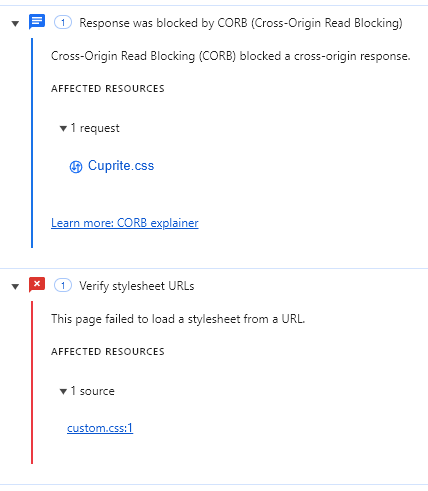

Individual tweaks will be available at a later date.

## Screenshots

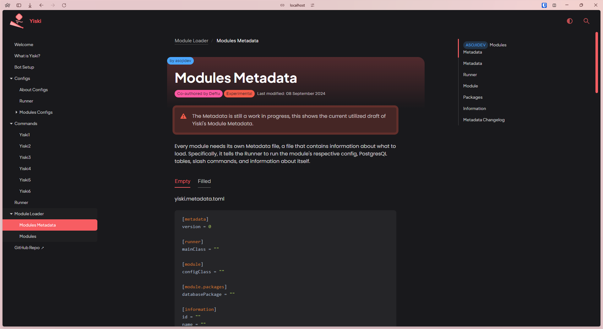
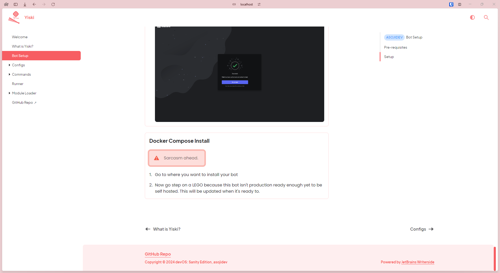
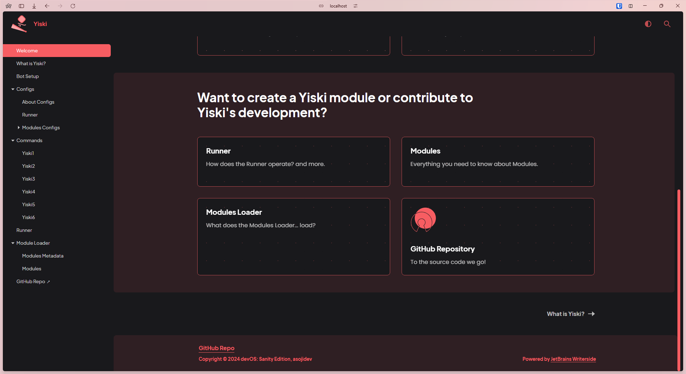
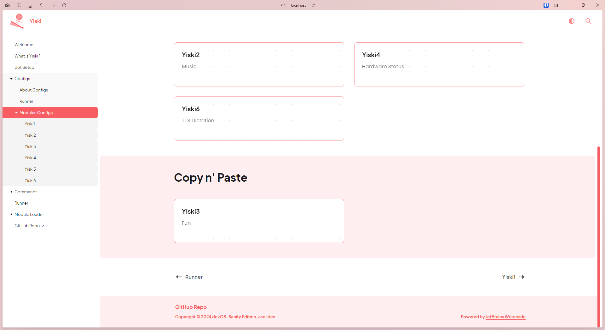
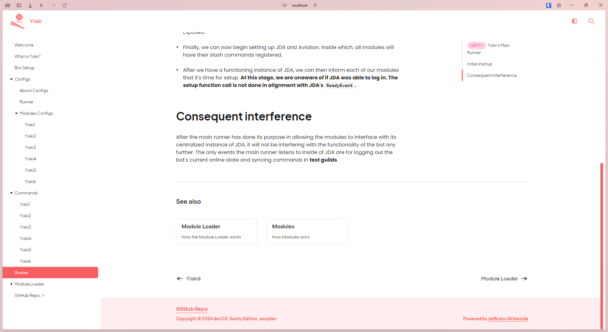
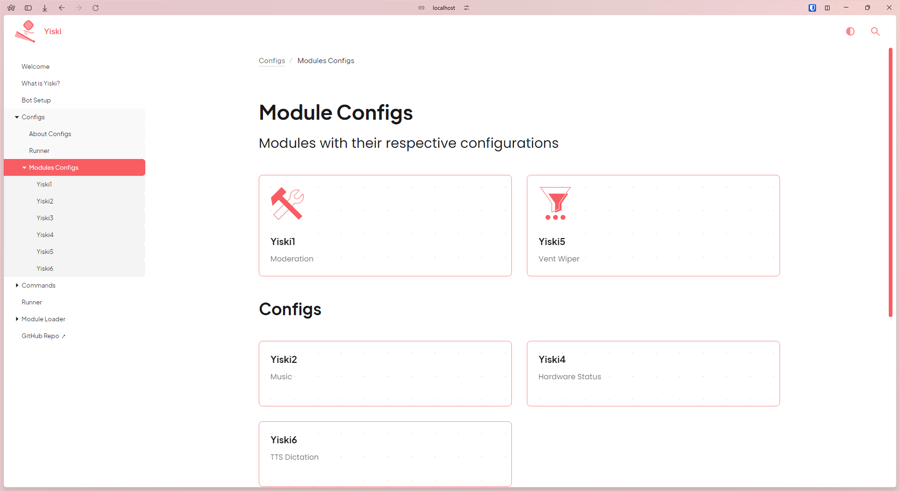
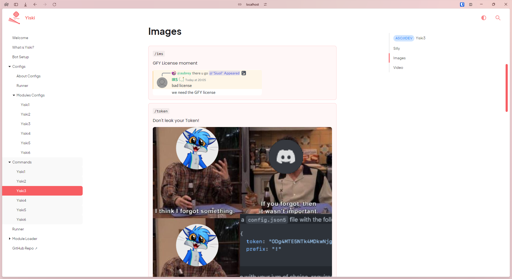
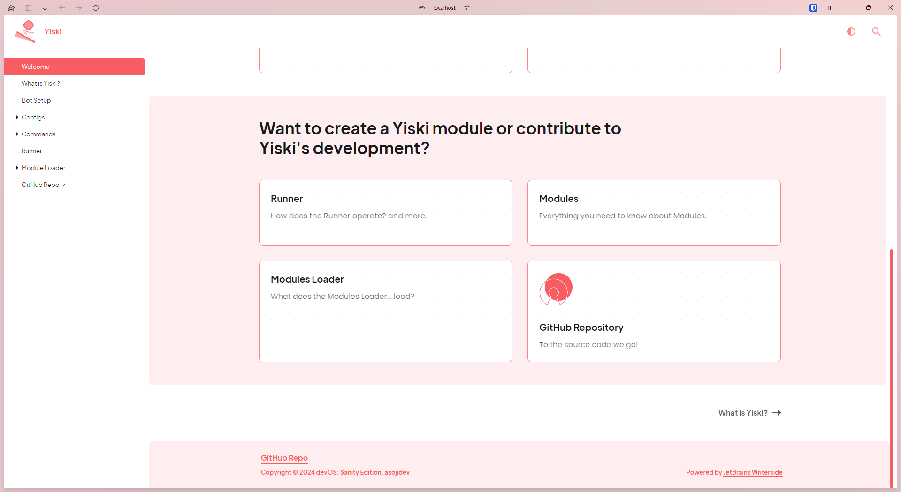
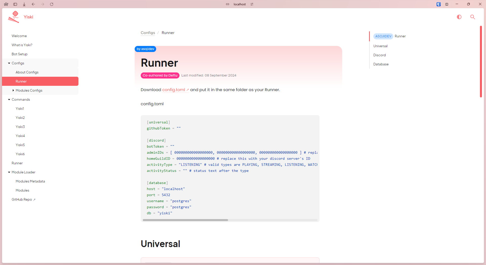
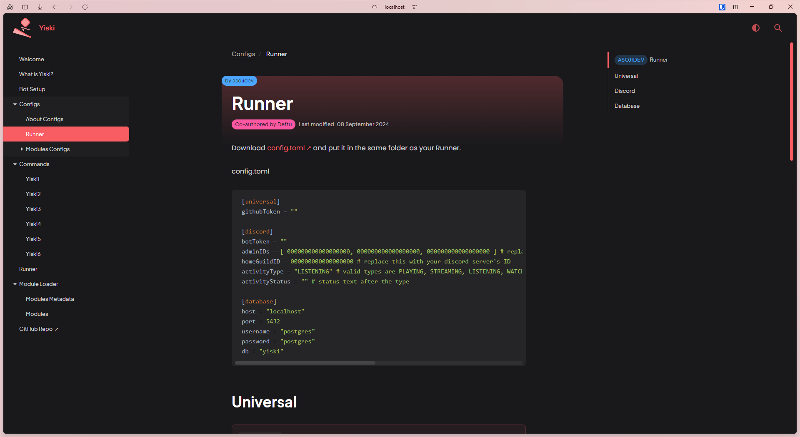
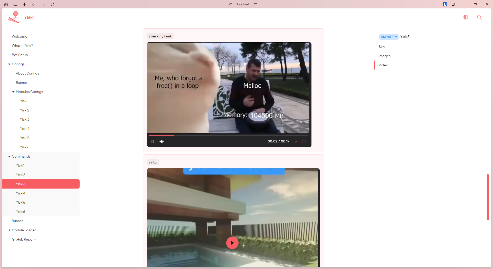

## Videos

https://github.com/user-attachments/assets/ca873f31-5419-4eb0-b56f-249146f3cc93

https://github.com/user-attachments/assets/12418d1a-35b2-4c8d-b8cb-80a45b5e0ec6

https://github.com/user-attachments/assets/3e61d459-1bd1-412a-afe7-398daa3301d2

## License
This project is licensed under the [MIT License](LICENSE).
